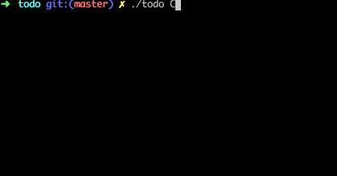

# Todo

A simple, clean todo list for your command line.

## Usage



## Installation

You can download the latest release [here](https://github.com/shcallaway/todo/releases). I recommend moving it into `/usr/local/bin` for convenient access!

Of course, you can also download Todo from your command line:

```
curl -L https://github.com/shcallaway/todo/releases/download/v1.0/todo -o todo \
  && chmod 750 todo \
  && mv todo /usr/local/bin/todo
```

## Contributing

If you encounter a bug or think of an enhancement while using Todo, please open an issue or a pull request.

Todo is written in [TypeScript](https://www.typescriptlang.org/). You can compile it to JavaScript with `yarn compile`. I recommend practicing test-driven developement because compilation slows down the feedback loop significantly.

### Dependencies

* [Node](https://nodejs.org/en/) 8.4.9
* [Yarn](https://yarnpkg.com/en/) 1.2.1

### Testing

Todo is tested using [Mocha](mochajs.org) and [Sinon](http://sinonjs.org/). You can run the tests with `yarn test`.

### Debug

Set the following environment variable to see verbose logs: `DEBUG=*`

_This feature is available even while running the binary!_
